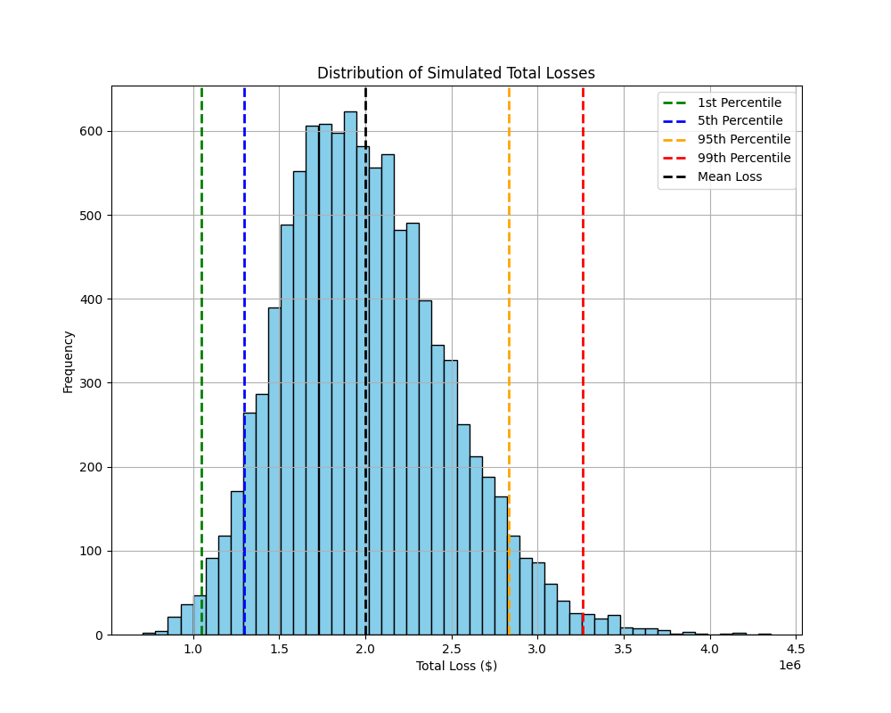

# Monte_Carlo
A small scale implementation of a Monte Carlo Simulation for practice

In this Project I am going to use some assumptive variables to run a simulation for a loan portfolio. I am going to use numpy to generate x number of samples based on some default rate assumptions as well. I will be adding these values and my analysis both pre and post simulation to offer some solutions based on the best case, worst case and average case situations.

## Baseline Parameters used
- A total of 10000 simulations were ran for each distribution and scenario.
- The total portfolio value exposed was $100 million.
- For consistency a mean default rate of 5% was used with a standard deviation of 1%.
- The mean loss given default (LGD) was 40% with a standard deviation of 5%.

##  Summary of Monte Carlo Simulations - Normal w/ clipping - `normal_distributions.py` file
Mean Loss: $2,002,098.13
Median Loss: $1,978,980.74
95th percentile (VaR): $2,827,982.29
99th percentile (VaR): $3,196,128.56
5th Percentile (VaR): $1,261,985.08
1st Percentile (VaR): $999,827.02
Max Loss: $4,014,130.34
Min Loss: $367,779.17

### Analysis
- Based on the output from the simulation we can see some specific metrics to define some range cutoffs that can be used for decision making on loan portfolios. 
- In a business scenario, this gives valuable information about what could happen in the most extreme of circumstances given the current distribution of LGD and Default Rate. 
- It is important to note however, that this is based on a normal distribution of the values and is used as a baseline case. It does not adequately reflect what should be done in a real world scenario because some values that are greater than 1 or less than 0 could be clipped in and make the simulation unstable and perhaps unusable.

- A beta distribution should be simulated to more accurately reflect real world conditions.

## Summary of Monte Carlo Simulations - Beta Distribution from the `beta_distribution.py` file
Mean Loss: $1,999,668.69
Median Loss: $1,958,115.67
95th percentile (VaR): $2,832,480.38
99th percentile (VaR): $3,264,101.23
5th Percentile (VaR): $1,295,365.22
1st Percentile (VaR): $1,049,825.94
Max Loss: $4,352,771.60
Min Loss: $708,099.53

### Analysis
- This simulation shows slightly different results than the normal distribution. For the majority of the produced statistics there doesn't seem to be much of a difference in the ranges. However, the one to make an important note of is the difference in the minimum loss stat for both outputs.
- The minimum loss for the beta distribution is approximately $340 thousand dollars higher than that of the normal distribution. This refelcts the validity of the beta distribution over the normal.
- This skew is most likely because of any clipped values that were on the lower end of the distribution being binned into the smaller percentiles instead of staying towards a real world distribution. 

- Based on this analysis, when given a range of tolerance values by management we could trigger various alerts when the portfolio is trending towards default rates that put the portfolio at risk. 

